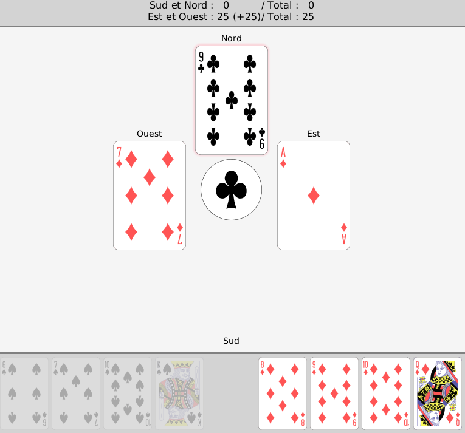

# Javass
The Jass coded in Java ! In teams of two, the goal of this project was to get
more familiar with Java. We were able to get more familiar with graphical interfaces 
but also with serialization of messages as the game is actually playable 
in a LAN with friends. 

## Requirements
Java 8

## Launching the game
To launch the game you need to run the main: `src/main/java/LocalMain.java`
with the following arguments:  j1 j2 j3 j4  
jn represents the n-th player and must be one of the following:  
- h:'name' a human player with the name 'name'
- s:'name' a simulated player with the name 'name'
- r:'name':'ip' a remote player with the name 'name' followed by their IP address 

### In solo mode
In solo mode you play with a bot against two other bots.
The simulated players pick their next card to play according to the Monte Carlo Tree Search algorithm.

An example of configuration for such a game would then be:
`h:Alice s:East s:North s:West`

### In multiplayer mode
If, for example, Alice and Bob want to play together against two bots, 
Bob first needs to run the `RemoteMain` (i.e. the server), Alice can then run the `LocalMain` 
(i.e. the client) with the following configuration:
`h:Alice s:East r:Bob:192.168.0.1 s:West`
where "192.168.0.1" is Bob's IP address

